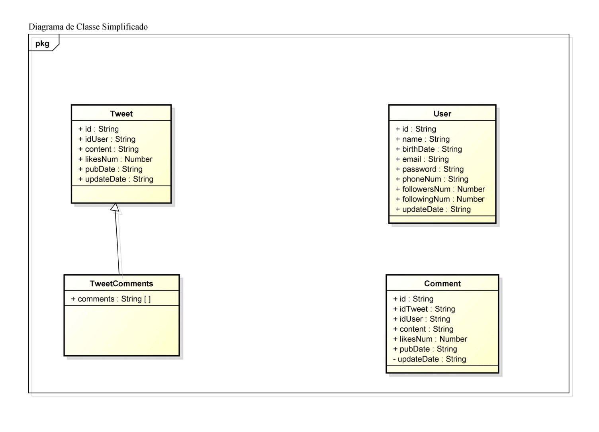

# Atividade: Twitter-API (back-end)

- Protótipo de API do Twitter;

- Utiliza Arquitetura REST e Clean DDD;

- Utiliza o Firebase Firestore como banco de dados;
---

### Rotas:

#### Tweets:
  - Listar todos os tweets | **/tweets**
  - Listar um tweet | **/tweets/:id**
  - Adicionar tweet | **/tweets/create**
  - Alterar dados gerais do tweet | **/tweets/update/:id**
  - Deletar tweet | **/tweets/delete/:id**
  - Incluir comentário | **/tweets/comment/:id**
  - Dar like | **/tweets/like/:id**

#### Users:
  - Listar todos os usuários | **/users**
  - Listar um usuário | **/users/:id**
  - Adicionar usuário | **/users/create**
  - Alterar dados gerais do usuário | **/users/update/:id**
  - Deletar usuário | **/users/delete/:id**

---

### Classes Principais:

- Para rodar, digite "**yarn dev:run**".
